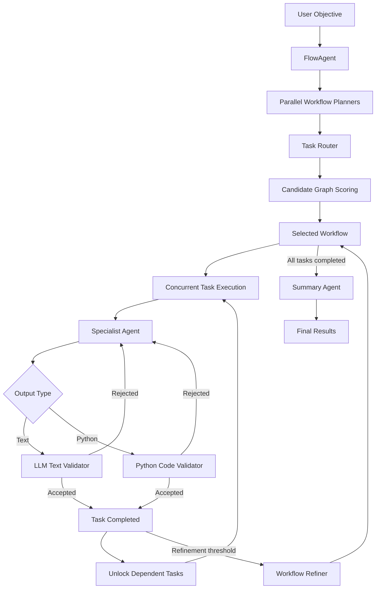
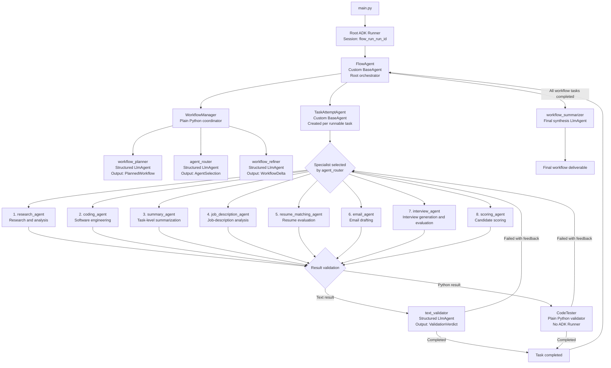

# Flow: Modularized Agentic Workflow Automation

An implementation of Modularized Agentic Workflow Automation using Google ADK and Gemini.

Reference:  ["FLOW: Modularized Workflow ICLR 2025 "](https://arxiv.org/abs/2501.07834)

Flow converts a high-level objective into an Activity-on-Vertex (AOV) task graph, assigns specialized agents, executes independent tasks concurrently, validates their results, dynamically refines the workflow, and synthesizes a final deliverable.

## Architecture



## Features

- Activity-on-Vertex workflow graphs
- Concurrent candidate workflow generation
- Automatic task decomposition
- Dependency-aware asynchronous execution
- Specialist-agent routing
- Text and Python result validation
- Feedback-driven task retries
- Runtime workflow refinement
- Final deliverable synthesis
- Per-run logs and result artifacts
- Google ADK session-based conversation history

## End-to-End Workflow

### 1. Objective input

The workflow objective is currently configured in `main.py`:

```python
overall_task = """
Describe the objective that Flow should complete.
"""
```

The current implementation does not read a query from CLI arguments or standard input.

### 2. Candidate workflow generation

Flow starts multiple planner-agent calls concurrently. Each planner returns a structured workflow containing approximately 5–8 tasks.

Every planned task includes:

- `id`
- `objective`
- `output_format`
- `prev`: prerequisite tasks
- `next`: downstream tasks

Failed candidates are discarded. Execution stops if every candidate fails.

### 3. Specialist routing

Each task is passed to a router agent, which assigns one of the available specialists:

1. Research
2. Coding
3. Summarization
4. Job-description analysis
5. Résumé matching
6. Email drafting
7. Interviewing
8. Candidate scoring

All routing requests for a candidate are executed concurrently.

### 4. Candidate scoring

Candidate workflows are evaluated using:

- dependency complexity;
- average available parallelism.

The framework normalizes both measurements and selects the graph that favors lower dependency complexity and greater parallel execution.

The selected initial workflow is saved as `initflow.json`.

### 5. Dependency-aware execution

A task becomes runnable when:

- its status is `pending` or `failed`; and
- all declared prerequisites have completed.

All currently runnable tasks execute concurrently using `asyncio`.

Each task receives:

- the overall objective;
- results from its direct parent tasks;
- objectives of its direct downstream tasks;
- its own objective;
- its required output format.

### 6. Specialist execution

Each runnable task is wrapped in a `TaskAttemptAgent`.

The assigned specialist generates the task result through Google ADK. A persistent session named `exec_<task_id>` retains conversation context across validation retries.

Specialists currently generate text only. They do not have tools for browsing, sending email, editing files, or interacting with external systems.

### 7. Validation and retries

Every generated result is classified as either Python-like output or text.

#### Text validation

Text results are evaluated by a structured Gemini validator using:

- the overall objective;
- the current task objective;
- the required output format;
- the generated result.

The validator returns:

- `completed` when the result is acceptable;
- `failed` with feedback when revision is required.

#### Python validation

Python-like results are processed by a local validator that performs syntax, AST, import, structural, and limited execution checks.

> [!WARNING]
> Python validation uses `exec()` and is not sandboxed. Do not run untrusted objectives or generated code on sensitive systems.

#### Re-execution

When validation fails:

1. Feedback is saved in task history.
2. Feedback is sent to the same specialist session.
3. The specialist generates a revised result.
4. Validation runs again.

Setting `max_validation_itt` to `0` disables validation.

### 8. Dynamic workflow refinement

After a configured number of task attempts, Flow pauses new scheduling and asks a refiner agent to evaluate the current graph.

The refiner can:

- leave the graph unchanged;
- add tasks;
- remove tasks;
- modify objectives;
- change dependencies;
- change required output formats.

Changed tasks are routed again, merged into the workflow, and affected downstream tasks may be invalidated and re-executed.

Refinement receives graph structure and task statuses. It currently does not receive detailed task outputs, validator feedback, or timing metrics.

### 9. Final synthesis

When every task is completed, a summary agent receives:

- the original objective;
- the final workflow structure;
- the latest output from each task.

It produces an integrated final deliverable rather than a description of the internal workflow.

## Agent Hierarchy



### Runner Hierarchy

```mermaid
flowchart TD
    subgraph OUTER["Root orchestration runtime"]
        ROOTSERVICE["Dedicated InMemorySessionService"]
        ROOTRUNNER["Root ADK Runner"]
        FLOW["FlowAgent<br/>Custom BaseAgent"]

        ROOTSERVICE --> ROOTRUNNER
        ROOTRUNNER --> FLOW
    end

    subgraph ORCHESTRATION["Python orchestration layer"]
        FLOW --> WM["WorkflowManager"]
        FLOW --> TA["TaskAttemptAgent instances"]
        FLOW --> GRAPH["Workflow and Task graph"]
        FLOW --> ASYNC["asyncio scheduler<br/>locks and event queue"]
    end

    WM --> INNER
    TA --> INNER

    subgraph INNER["Shared LLM runtime — adk_runtime.py"]
        SERVICE["Global InMemorySessionService"]
        CACHE["Runner cache<br/>one Runner per agent name"]

        SERVICE --> CACHE

        CACHE --> PR["workflow_planner Runner"]
        CACHE --> RR["agent_router Runner"]
        CACHE --> RFR["workflow_refiner Runner"]
        CACHE --> VR["text_validator Runner"]
        CACHE --> SR["Specialist Runner"]
        CACHE


## Project Structure

```text
.
├── main.py                  # Application entry point
├── flow_agent.py            # Root scheduler and orchestrator
├── workflow_manager.py      # Planning, scoring, routing and refinement
├── workflow.py              # Workflow graph and task state
├── planning_agents.py       # Planner, router and refiner agents
├── task_agents.py           # Task execution and retry loop
├── validation_agents.py     # Text/Python validation dispatch
├── code_test_module.py      # Local Python checks and execution
├── summary_agent.py         # Final deliverable synthesis
├── agent.py                 # Specialist agent definitions
├── adk_runtime.py           # Shared ADK runners and sessions
├── schemas.py               # Structured Pydantic outputs
├── history.py               # Task result and feedback history
├── prompt.py                # Agent instructions and prompts
├── config.py                # Gemini model configuration
├── logging_config.py        # Run directories, logs and artifacts
└── requirements.txt
```

## Requirements

- Python 3.10 or newer
- Google Gemini API key

Main dependencies:

- `google-adk`
- `google-genai`
- `networkx`
- `python-dotenv`

## Installation

```bash
git clone https://github.com/tmllab/2025_ICLR_FLOW.git
cd 2025_ICLR_FLOW

python -m venv .venv
source .venv/bin/activate

pip install -r requirements.txt
```

Windows activation:

```powershell
.venv\Scripts\activate
```

## Configuration

Create a `.env` file in the repository root:

```env
GOOGLE_API_KEY=your-google-api-key
```

All agent roles currently use `gemini-2.5-flash`. Model settings are defined in `config.py`.

Configure the workflow in `main.py`:

```python
candidate_graphs = 5
refine_threshold = 3
max_refine_itt = 5
max_validation_itt = 5
```

- `candidate_graphs`: number of planner candidates.
- `refine_threshold`: task attempts between refinements.
- `max_refine_itt`: maximum workflow refinements.
- `max_validation_itt`: validations per task; use `0` to disable.

## Running Flow

```bash
python main.py
```

The terminal displays progress events and model usage statistics.

## Output Files

Each execution creates a timestamped directory:

```text
runs/run_<timestamp>/
├── run_metadata.json
├── initflow.json
├── final_summary.txt
├── logs/
└── results/
    ├── workflow_final_state.json
    ├── final_summary.json
    └── workflow_*.json
```

- `run_metadata.json`: objective and execution configuration.
- `initflow.json`: selected initial workflow.
- `workflow_final_state.json`: final task graph and latest outputs.
- `final_summary.json`: synthesized result and original objective.
- `final_summary.txt`: plain-text final deliverable.
- `logs/`: component and execution logs.

## Known Limitations

- The objective is currently hard-coded in `main.py`.
- Specialist agents do not have external tools.
- Workflow graphs are not fully checked for cycles or dangling references.
- Failed tasks may be rescheduled without a workflow-level retry limit.
- Unexpected task exceptions can leave a workflow waiting indefinitely.
- Python execution is not sandboxed.
- Refinement does not receive detailed validation feedback or task outputs.
- ADK sessions use in-memory storage and are not persisted.
- Final workflow serialization exposes the latest result rather than complete attempt history.

## Citation

If you use Flow in your work, please cite:

```bibtex
@article{niu2025flow,
  title={Flow: Modularized Agentic Workflow Automation},
  author={Niu, Boye and Song, Yiliao and Lian, Kai and Shen, Yifan and Yao, Yu and Zhang, Kun and Liu, Tongliang},
  journal={ICLR},
  year={2025}
}
```

## License

See the repository license for usage and distribution terms.

## Citation
 ["FLOW: Modularized Workflow ICLR 2025 "](https://arxiv.org/abs/2501.07834)
